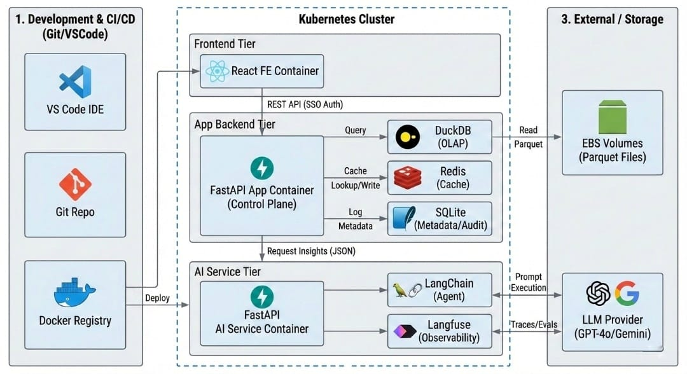

# Multi-Agent GenAI Analytics Platform
**FastAPI · Databricks · LLM Orchestration · Cost Governance · LLM-as-Judge**

**Client:** Large-scale eCommerce client  
**Role:** Principal Architect  

---

## Executive Summary

| Metric | Value |
|--------|-------|
| Concurrent users (production) | 1,000+ (architected to 10,000) |
| Response latency target | &lt;100ms |
| Reports automated per week | 60 |
| FTE manual effort replaced | 40 FTE |
| Annual operational overhead eliminated | $100K/year |
| LLM inference cost reduction | 65% ($8 → $2.50 per request) |

---

## 1. Problem Context &amp; Business Objective

Category managers were responsible for evaluating category performance across 12+ dimensions — traffic source, geography, device type, time frames — each with multiple levels (e.g., traffic source L1/L2), resulting in over 100 possible analytical combinations per category.

Weekly and monthly performance reviews were critical inputs for:
- Sales and marketing budget allocation
- Incentive planning
- Category-level performance decisions

However, generating these insights required manual exploration of multiple dashboards and reports, making the process time-consuming, error-prone, and heavily dependent on analyst support. The evaluation process:
- Consumed **40 FTE** of analyst and manager time every week
- Did not scale as the number of categories and regions grew
- Risked inconsistent or biased interpretation across teams

Stakeholders included category managers, regional managers, and sales &amp; marketing leadership up to VP and C-suite level — with weekly platform outputs consumed directly by senior leadership for budget allocation and incentive planning decisions worth tens of millions annually.

**Objective:** Automate performance analysis across multiple dimensions, surface actionable insights, and reduce dependency on manual reporting while maintaining strict cost and latency constraints.

---

### Key Constraints

- Cost-sensitive LLM usage: frequent (weekly) report generation at enterprise scale
- End-to-end response time under 100ms for interactive use
- Large structured datasets requiring hierarchical and cross-dimensional analysis
- Weekly data refresh cadence with consistent historical comparisons

---

## 2. Why LLM-Based Approach?

A rule-based system was evaluated first. This proved unsuitable:
- The number of rules grew rapidly with dimensions, categories, and business contexts — hard to maintain and scale
- Rule definitions were subjective and varied across teams, introducing inconsistency into performance assessments
- Rules required frequent manual updates with no learning or optimisation over time
- An existing Tableau dashboard already showed all metrics — the problem was synthesising relationships across dimensions at decision speed

An LLM-based evaluation layer was chosen to:
- Aggregate and reason over large, structured performance datasets across hierarchical dimensions
- Reduce manual interpretation effort while maintaining explainability
- Provide consistent summaries and insights across categories and regions
- Scale across categories without per-category rule customisation

---

## 3. Data Landscape

The primary data source resided on an internal Big Data Platform (BDP) exposing TB-scale transactional datasets. Query latency was variable due to resource contention across multiple teams.

A dedicated ETL pipeline was designed to extract and materialise the required datasets on a scheduled basis — aligned with downstream consumption needs and optimised for predictable performance.

The transactional data was at terabyte scale, optimised primarily for write-heavy ingestion. No dedicated OLAP layer was available; most teams relied on ad-hoc SQL aggregations. For this system, performance reports were refreshed on a weekly cadence with controlled snapshots to enable consistent week-over-week comparisons.

---

## 4. Feature Engineering &amp; Data Representation

The system operated in **extract-based mode** rather than live data connection. Given that performance reviews were conducted weekly and downstream actions required multiple days to implement, near-real-time data did not provide additional value. Batch extraction enabled predictable performance, lower cost, and consistent snapshots.

Features were constructed by aggregating transactional data into an OLAP-style representation — SQL aggregations materialised as partitioned Parquet files optimised for downstream processing.

Feature categories:
- **Sales metrics** — revenue, conversion, growth trends
- **Marketing metrics** — traffic sources, campaign performance
- **User engagement metrics** — visits, retention signals
- **Finance metrics** — budget allocation, spend efficiency

An external market-pulse signal was introduced to capture category-level trends from public internet sources, allowing the model to contextualise internal performance with external demand conditions — directly influencing marketing budget decisions.

All feature values were normalised with explicit unit annotations (currency, percentage points). Missing values were imputed using metric-specific defaults based on business relevance — ensuring absence of data did not distort downstream reasoning.

---

## 5. Model Choice

The solution operated within enterprise AI governance constraints. All LLMs were centrally managed by a platform team responsible for responsible AI, security, and compliance. Model selection was limited to approved options: **GPT-4o** and **Gemini**.

A comparative evaluation was conducted using representative performance datasets. Both models were prompted with identical structured inputs and reviewed by business stakeholders using a qualitative scoring framework (1–5) for relevance, clarity, and actionability. **GPT-4o consistently scored higher**, particularly in synthesising multi-dimensional signals into concise insights, and was selected as the primary model.

Model selection was decoupled from application logic through an abstraction layer, enabling endpoint switching without changes to downstream pipelines.

---

## 6. System Architecture

The system follows a modular, service-oriented architecture with strict separation between user-facing services and AI execution, enabling independent scaling, cost control, and governance.

### Technology Stack Decisions

**Language:** Python — tight integration with data processing, feature engineering, and AI workflows; used consistently across ETL, backend services, and AI logic.

**Backend Framework:** FastAPI — native async request handling, strong typing via Pydantic, low overhead, clear API contracts.

**Frontend:** React — fine-grained control over user interactions, role-based UI rendering, and clean separation between presentation and backend logic. Streamlit was evaluated and rejected: limited support for complex interactions, constraints on data access control, and challenges scaling to multi-user enterprise applications.

---

### High-Level Components

#### Frontend (React)
- Enterprise SSO–based authentication and session initiation
- Role-based access control to dashboards and reports (category manager, regional manager, leadership)
- Interactive filtering (category, region, time window) with stateless UI rendering
- Auth-aware API consumption using secure session tokens
- No direct interaction with LLM or data storage layers — minimising exposure

#### Application Backend (FastAPI)
- Asynchronous request orchestration using non-blocking I/O
- Acts as the **control plane**: authentication, authorisation, data access, prompt assembly, response post-processing
- Aggregated OLAP datasets queried using DuckDB for low-latency analytical access
- Server-side session management via secure cookies
- Controlled delegation of LLM execution to the AI Service
- Response caching (Redis for high-concurrency short-lived cache; SQLite for lightweight persistence — sessions, metadata, audit logs)

#### AI Service (FastAPI)
- Dedicated service responsible solely for AI inference
- Encapsulates prompt execution, LLM provider interaction, output normalisation
- **Model abstraction layer** — provider switching without upstream changes
- Request-level caching to avoid repeated LLM calls for identical inputs
- Guardrails: prompt validation, response schema enforcement, output consistency checks
- Token usage and cost tracking at user and team level
- Budget enforcement logic for enterprise chargeback and cost-overrun prevention

#### Data Layer
- Weekly aggregated OLAP-style Parquet datasets stored on EBS volumes
- Parquet directories mounted into containers for read-only analytical access
- Seller-level and PII data anonymised for compliance
- Parameterised ingestion queries stored as YAML for readability, auditability, and fast iteration
- Cached inference outputs stored for compliance, audit, and historical analysis

---

## 7. Key Design Decision: Custom Async Router vs LangGraph

**LangGraph was evaluated** for agentic routing in the initial design phase. After benchmarking under production load conditions, the framework introduced latency overhead that conflicted with the &lt;100ms end-to-end response requirement.

**Decision:** Replaced LangGraph with a purpose-built **asynchronous FastAPI routing layer**.

**Why this was the right call:**
- LangGraph's graph traversal and state management added latency that was not offset by functional gains for this use case — the routing logic was deterministic enough to be handled by a lightweight custom implementation
- The custom router provided full control over concurrency patterns, connection pooling, and graceful degradation behaviour
- Simpler, stateless routing reduced operational complexity and failure surface
- Enabled fine-grained observability: request tracing, per-agent latency logging, and cost attribution per route

This decision reflects a deliberate trade-off: less framework abstraction in exchange for predictable latency, operational control, and cost efficiency at scale.

---

## 8. LLM Evaluation Framework

### LLM-as-Judge Design

A dedicated LLM-as-Judge evaluation pipeline was implemented to assess output quality before serving to end users.

**Evaluation dimensions scored per-output:**
- **Relevance** — does the insight directly address the category-dimension slice?
- **Clarity** — is the language accessible to a non-technical category manager?
- **Actionability** — does the insight suggest a direction for decision-making?

Outputs below threshold were flagged for regeneration or human review, rather than served directly.

### Human-in-the-Loop Review
- A sample of weekly outputs was routed to a human review queue
- Reviewer ratings were logged and used to calibrate the LLM judge's scoring criteria over time
- This feedback loop was essential during the first 4–6 weeks of production operation, where LLM judge miscalibration was identified and corrected

---

## 9. Prompt Engineering &amp; Input Representation

Prompts are constructed using **structured templates** — not raw text — to control token usage and improve determinism.

### Prompt Design Principles
- Hierarchical encoding: Category → Subcategory → Metric
- Explicit metric definitions and units
- Instruction separated from data payload
- Deterministic JSON-based output schema

Prompt templates are versioned and managed independently from application code for iterative refinement.

---

## 10. API Design &amp; Contracts

### Application Backend APIs

- `GET /login-url` — Redirects to enterprise SSO; returns user to application on successful login
- `GET /auth-me` — Validates active session; returns user metadata and role attributes
- `GET /category-list` — Returns unique filter values for frontend rendering
- `POST /wbr` — Accepts user filter parameters; returns consolidated JSON with aggregated tables, derived metrics, and LLM-generated summaries

### AI Service APIs

- `POST /llm/summary` — Accepts structured input, validates schemas, executes LLM workflow, returns insights
- `GET /llm/async` — Enables asynchronous execution for concurrent requests and long-running inference tasks

Strict schema validation at all service boundaries mitigates prompt injection risk and ensures stable integration.

---

## 11. Performance, Scaling &amp; Cost Controls

### Scaling Strategy
- Horizontal scaling of FastAPI services using stateless containers
- Authorisation endpoints with multiple workers for concurrent session handling
- Batch LLM inference for weekly reporting cadence
- Async request handling and connection pooling for concurrent user requests

### Cost Controls
- Prompt size reduction via upstream aggregation (flat JSON, stop-word reduction)
- Semantic and exact-match output caching for repeated queries
- Rate limiting per user and per role
- Dynamic model routing: simpler queries routed to lower-cost models; complex synthesis to GPT-4o
- Centralised cost monitoring per model invocation
- **Result: LLM inference cost reduced from $8 to $2.50 per request (65% reduction)**

---

## 12. Reliability &amp; Failure Handling

### Failure Scenarios
- Partial data availability from upstream ETL
- LLM timeout or degraded response quality
- Budget or quota exhaustion

### Mitigations
- Fallback to last successful cached report
- Graceful degradation with partial insights rather than full failure
- Retry logic with exponential backoff
- Alerting on anomaly detection in response quality scores

---

## 13. Security &amp; Governance

- Role-based access control enforced at API level with SSO authentication
- No raw transactional data sent to LLM services — pre-aggregated summaries only
- Server-side cookie for session management
- Prompt sanitisation and schema-level injection prevention
- Centralised logging and audit trails for all LLM interactions

---

## 14. Monitoring &amp; Observability

### Metrics Tracked
- API latency and error rates per endpoint
- LLM invocation counts and cost per user, team, and model
- Prompt token size distribution and validation failures
- LLM-as-Judge output quality scores over time

Logs and metrics were used to continuously refine prompt design and cost–performance trade-offs.

---

## 15. Deployment &amp; Environment Strategy

- Containerised deployment (Docker)
- Separate environments: dev, staging, production
- CI/CD with automated schema validation
- Feature flags for controlled rollout of prompt or model changes

---

## 16. Key Design Decisions Summary

| Decision | Choice | Rationale |
|----------|--------|-----------|
| Inference mode | Batch over real-time | Cost, consistency, matches weekly decision cadence |
| Agent routing | Custom FastAPI async router | Lower latency than LangGraph at production scale |
| LLM evaluation | LLM-as-Judge + human review loop | Output quality assurance before serving |
| Frontend | React over Streamlit | Enterprise RBAC, multi-user, separation of concerns |
| Data access mode | Extract-based OLAP snapshots | Predictable performance, cost control, WoW consistency |
| AI service isolation | Dedicated FastAPI service | Independent scaling, governance, provider switching |

---

## 17. Lessons Learned

- **Custom routing outperforms framework abstraction at latency-sensitive scale:** LangGraph provided a clean mental model but introduced overhead that conflicted with production SLAs. For deterministic routing logic, a purpose-built async layer is the right call — not a generic agentic framework.
- **LLM evaluation must be designed before go-live, not added after:** The LLM-as-Judge pipeline caught systematic output quality issues in the first weeks. Without it, degraded outputs would have reached VP-level stakeholders and eroded trust in the system.
- **Semantic caching is high-ROI but has failure modes:** Cache hit rate depends heavily on query normalisation. Queries with minor parameter variations (different time windows, region spellings) produced cache misses. A query normalisation layer was added post-launch to improve this.
- **Prompt versioning is non-negotiable at scale:** Uncontrolled prompt changes caused measurable output regressions. Versioned prompt templates with rollback capability are essential from day one.
