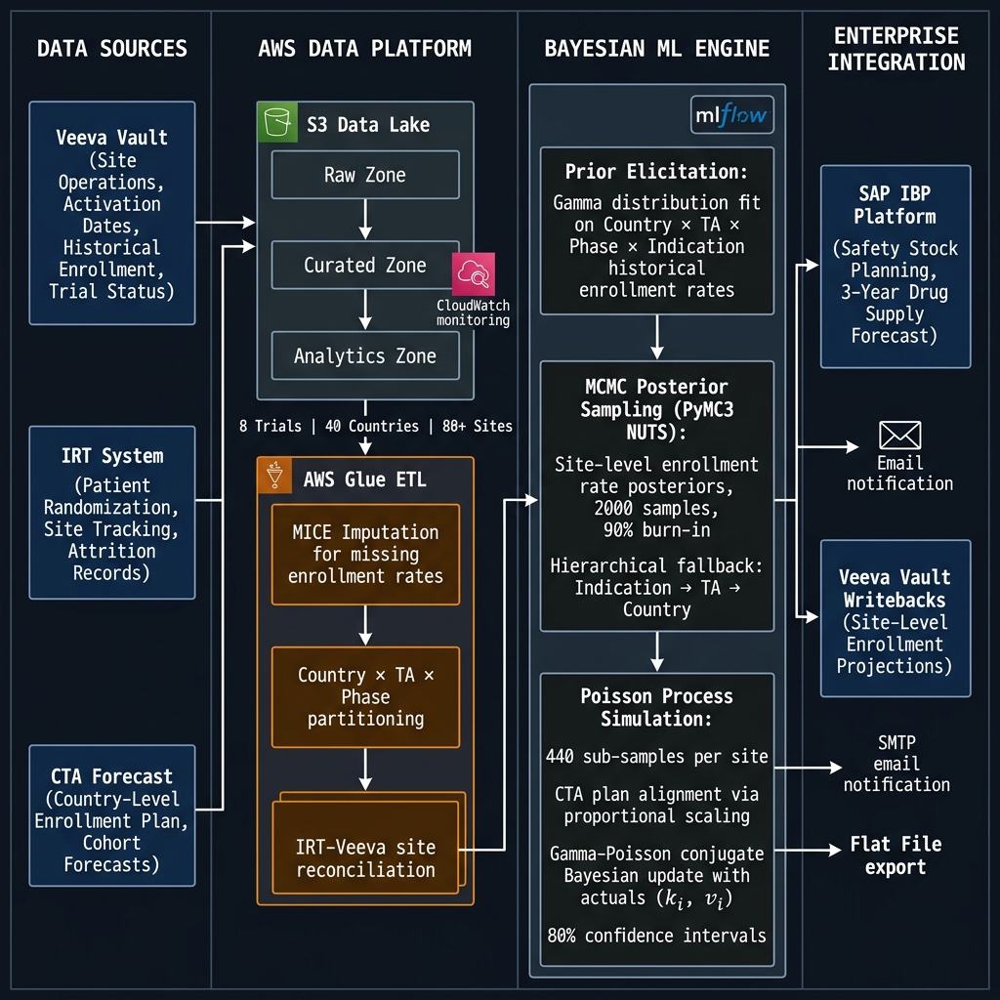

# Bayesian MCMC Site-Level Patient Enrollment Forecasting - Clinical Trial Supply Chain
**PyMC3 · Gamma-Poisson Bayesian Inference · AWS Glue · S3 · MLflow · SAP IBP · Veeva Vault**

**Client:** Global Pharmaceutical Client (Top-10 Oncology Biopharma)  
**Role:** ML Engineer & Data Engineering Lead · MLOps Architect  
**Programme Scale:** 8 Phase 2/3 Oncology Trials · 40 Countries · 80+ Trial Sites · 2-Year Delivery  

> *This case study demonstrates core ML engineering principles applicable across any domain requiring probabilistic demand forecasting under extreme data sparsity: Bayesian hierarchical modelling, uncertainty-aware supply planning, and production MLOps for regulated enterprise environments. The model output was adopted at VP level - replacing a methodology that had been in place for over a decade - validating both the technical rigour and the stakeholder engagement approach required to drive change at this scale.*

---

## Executive Summary

| Metric                                                                 | Value                                                                    |
| ---------------------------------------------------------------------- | ------------------------------------------------------------------------ |
| Estimated supply waste avoidable over 10 years (model vs 2× heuristic) | **~$2B USD**                                                             |
| Safety stock heuristic replaced                                        | **2× enrolled patients (over-ordering baseline)**                        |
| Supply planning horizon extended                                       | **3 years (site-level, probabilistic)**                                  |
| Forecast accuracy (MAE, monthly)                                       | **63% - first quantitative forecast in client's oncology trial history** |
| Trials monitored                                                       | **8 Phase 2/3 oncology trials**                                          |
| Geographic coverage                                                    | **40 countries**                                                         |
| Prior method                                                           | **None** - manual heuristic with no ML or statistical modelling          |
| Enterprise integration                                                 | **SAP IBP + Veeva Vault** via flat-file pipeline                         |

This system replaced the client's **2× enrolled-patient safety stock heuristic** - a blunt over-ordering rule that generated $2B of estimated drug and placebo waste over a 10-year horizon - with a **probabilistic, site-level, 3-year enrollment forecast** grounded in Bayesian inference. For large-molecule oncology drugs in Phase 2/3 blinded trials, where per-patient supply costs are substantial and blinded trial supply requires matched drug/placebo allocation, the reduction in systematic over-ordering had material commercial impact.

The system produced **the first statistically grounded supply forecast in the client's oncology trial history.**

---

## 1. Business Problem

### The Clinical Trial Supply Chain Problem

Pharmaceutical supply chain planning for clinical trials is fundamentally a **probabilistic enrollment forecasting problem** made structurally harder by:

- **Patient attrition**: Enrolled patients drop out of trials mid-study due to adverse events, withdrawal of consent, or protocol violations. Dropout rates vary significantly by therapeutic area, site, and country.
- **Site-level heterogeneity**: Each trial site has a different patient pool, investigator efficiency, country-level regulatory cycle, and activation timeline. A single country-level aggregate forecast masks enormous site-level variance.
- **Blinded trial complexity**: For double-blind controlled trials (active drug vs. placebo), drug and placebo must be supplied in matched quantities. Forecast error translates to imbalanced supply for active vs. control arms.

- **Long trial durations**: Phase 2/3 oncology trials have a 5-year duration. Supply commitments made at trial initiation must be defensible 3 years into the future.
- **Irreversible supply decisions**: Drug manufacturing lead times make late corrections expensive. Oncology biologics cannot be produced on-demand.

### The Heuristic That Was Replaced

The client's pre-existing approach to trial drug supply was a **2× multiplier on expected enrolled patients**: order twice the drug quantity implied by the planned enrollment. This heuristic:
- Did not differentiate by site, country, or therapeutic area
- Made no use of historical site performance data
- Did not account for enrollment velocity - only total planned headcount
- Generated **systematic over-ordering estimated at $2B in waste over a 10-year planning horizon**
- Provided no confidence intervals or scenario-based planning capability

### The Objective

Build a **site-level probabilistic enrollment forecasting system** that:
1. Produces monthly enrollment predictions per site, per country, per trial - with 80% confidence bands
2. Accounts for patient attrition and site-level dropout rates
3. Handles patient transfers between sites (tracked via IRT reference IDs)
4. Updates in real-time as actuals from IRT are observed (Bayesian updating)
5. Feeds into SAP IBP for 3-year supply planning, replacing the 2× heuristic

---

## 2. Why Bayesian MCMC - Not Classical Forecasting

### The Core Challenge: Extreme Data Sparsity at the Right Level of Granularity

The forecasting problem requires site-level, monthly predictions. In practice:
- Oncology trial sites typically enroll **1–5 patients per month**
- A given site may have only **3–10 historical observations** from prior trials in the same therapeutic area
- Many sites have **zero historical data** at the indication level - only country-level data exists

Classical time-series approaches (ARIMA, Prophet) require sufficient within-series observations to identify patterns. Site-level enrollment series - with monthly counts of 1–5 patients - violate this requirement entirely.

### The Bayesian Advantage

| Requirement                                        | Classical ML          | Bayesian MCMC                                |
| -------------------------------------------------- | --------------------- | -------------------------------------------- |
| Site-level monthly counts of 1–5                   | Insufficient signal   | ✅ Informative priors encode historical rates |
| Data sparsity at site level                        | Model collapses       | ✅ Prior from country-level observations      |
| Uncertainty quantification                         | Ad-hoc post-hoc CIs   | ✅ Native posterior distributions             |
| Hierarchical structure (indication → TA → country) | Manual stratification | ✅ Hierarchical prior fallback                |
| Bayesian updating with actuals                     | Requires retraining   | ✅ Conjugate posterior update (no retraining) |
| Interpretability for supply chain planners         | Black box             | ✅ Explicit probabilistic statement           |

### Why Gamma-Poisson

Patient enrollment at a site is naturally modelled as a **Poisson process**: patients arrive independently at a rate λ (patients per month). The Poisson parameter λ itself is site-specific and uncertain - modelling λ as a **Gamma-distributed random variable** gives the Gamma-Poisson (Negative Binomial) compound distribution, which:
- Accommodates overdispersion in real enrollment counts
- Provides a **conjugate prior-posterior structure** enabling closed-form Bayesian updates
- Produces natural 80% credible intervals aligned to supply planning needs

---

## 3. Data Architecture & Engineering

### Data Sources

| Source           | System                          | Contents                                                                                                                           |
| ---------------- | ------------------------------- | ---------------------------------------------------------------------------------------------------------------------------------- |
| **Veeva Vault**  | Clinical Operations             | Site activation dates, site status, historical enrollment rates (MICE-imputed), trial metadata, TA/Phase/Indication classification |
| **IRT System**   | Interactive Response Technology | Patient randomisation records, site-level monthly actuals, patient tracking IDs, dropout reason codes                              |
| **CTA Forecast** | Clinical Trial Agreement        | Country-level planned enrollment curve (Cohort-0 baseline), monthly expected totals                                                |

### AWS Data Platform

The data engineering architecture was designed and operated on AWS:

- **Amazon S3**: Three-zone data lake - Raw (source replication), Curated (validated, schema-enforced), Analytics (partitioned by country × protocol × site)
- **AWS Glue**: ETL pipeline executing:
  - Source-system schema normalisation across Veeva, IRT, and CTA formats
  - **MICE (Multiple Imputation by Chained Equations)** for missing enrollment rate imputation - critical because many historical trial sites have sparse records
  - IRT-Veeva site reconciliation (matching IRT site IDs to Veeva site IDs via trial metadata joins)
  - Country × TA × Phase × Indication partitioning for prior computation
  - Monthly incremental refresh aligned to IRT update cadence
- **Amazon CloudWatch**: Pipeline execution logging, data quality alerts, SLA monitoring for monthly batch jobs
- **SMTP**: Automated email notifications to trial operations teams on forecast completion and model alerts

### IRT-Based Patient Transfer Tracking

A non-trivial data engineering challenge: patients occasionally transfer between sites. Without correction, a transferred patient appears as a dropout at the source site and a new enrollment at the destination - inflating attrition and enrollment rates simultaneously.

Resolution: IRT stores a **patient tracking ID** and a **reason-for-dropout** field. By joining on tracking IDs across site records within a protocol, transfers were identified and excluded from attrition counts, with enrollment credited to the correct receiving site. This required building a patient-level reconciliation layer in Glue above the site-level aggregation.

---

## 4. Modeling Architecture

### Overall Design: Two Operating Modes

```
┌────────────────────────────────────────────────────────────┐
│  MODE 1: BASELINE FORECAST (Trial in Planning Stage)       │
│  Inputs: Veeva (historical) + CTA plan                     │
│  Output: Site-level enrollment projections from t=0        │
│  → Country_Forecast_Adaption.py                            │
├────────────────────────────────────────────────────────────┤
│  MODE 2: REFORECAST (Trial Active, IRT Actuals Available)  │
│  Inputs: Veeva + CTA plan + IRT actuals                    │
│  Output: Updated projections incorporating observed data   │
│  → Reforecast.py (Bayesian conjugate update)               │
└────────────────────────────────────────────────────────────┘
```

### Step 1 - Prior Elicitation (Country-Level Distribution Fitting)

For each `Country × TA × Phase` combination, historical enrollment rates from **completed or closing trials** (excluding the current protocol) were extracted. A **Gamma distribution** was fit to these rates using maximum likelihood estimation (SciPy):

```python
# Fit Gamma distribution to country-level historical enrollment rates
a, loc, scale = gamma.fit(data=metric_observed_values, floc=-1e-10)
param_dict = {'alpha': a, 'beta': 1/scale, 'loc': loc}
```

Two prior variants were generated per site:
- **Indication-level prior**: filtered to matching indication (e.g., solid tumour oncology)
- **TA-level prior**: filtered to therapeutic area only (broader, used as fallback)

### Step 2 - MCMC Posterior Sampling (Site-Level, PyMC3)

For each site with historical observations, the Gamma prior was updated against site-level observed enrollment rates using **MCMC posterior sampling** via PyMC3 with the NUTS (No-U-Turn Sampler):

```python
with pm.Model() as mcmc_model:
    # Informative Gamma prior from country-level distribution
    alpha = BoundedNormal('alpha', mu=alpha_mean, sigma=1, testval=10)
    beta  = BoundedNormal('beta',  mu=beta_mean,  sigma=1, testval=10)
    
    # Likelihood: enrollment rate is Gamma-distributed
    observed = pm.Gamma('obs', alpha=alpha, beta=beta,
                        observed=site_enrollment_rates)
    
    trace = pm.sample(2000, step=pm.NUTS(), chains=2, tune=200)

# Use final 10% of chain (post burn-in) for posterior estimates
alpha_posterior = trace['alpha'][int(0.9 * n_samples):]
beta_posterior  = trace['beta'][int(0.9 * n_samples):]
```

**Hierarchical Fallback Logic** (handles cold-start sites):

```
Site has indication-level data?
  └─ YES → MCMC update with indication-level prior
  └─ NO  → Site has TA-level data?
              └─ YES → MCMC update with TA-level prior
              └─ NO  → Sample directly from country-level Gamma prior
```

### Step 3 - Poisson Process Simulation

With each site's posterior Gamma parameters, enrollment trajectories were simulated using an **inverse-method Poisson process**:

```python
# Simulate patient inter-arrival times (inverse Poisson)
inter_event_time = -log(1 - uniform_random) / lambda

# Run 440 independent sample paths per site
# Generates monthly enrollment counts over the forecast horizon
```

This simulation naturally captures the **discrete, stochastic nature** of patient arrivals - months with zero patients, burst months, and long-term variance are all represented in the sample paths.

### Step 4 - CTA Plan Alignment

Raw MCMC-derived site rates are anchored to the country-level CTA forecast. The adjustment:

1. Compute each site's **proportional share** of the country-level MCMC enrollment rate
2. Compute the **residual** between the CTA plan and the sum of all site MCMC rates
3. Distribute the residual to each site proportionally - preserving site rankings while ensuring country totals match the agreed CTA plan

```python
psm_ratio = mean(site_samples) / country_level_mean
site_adjusted = site_samples + (psm_ratio * cta_residual)
```

### Step 5 - Reforecast: Bayesian Conjugate Update

Once trials are active, IRT actuals enable a **Bayesian posterior update** without re-running MCMC:

Given:
- `k_i` = patients actually enrolled at site i (from IRT)
- `v_i` = months the site has been active (from activation date to current month)
- Prior: `Gamma(α, β)`

→ **Conjugate posterior**: `Gamma(α + k_i, β + v_i)`

This is exact Bayesian updating for a Gamma-Poisson model. The posterior becomes the new sampling distribution for Poisson process simulation over the remaining forecast horizon.

### Confidence Interval Construction

80% confidence intervals were computed via t-distribution over the 440 sample paths per site:

```python
t_val = t.ppf((1 + 0.80) / 2, df=10000)  # ~1.282
lower = max(0, mean_enrollments - t_val * std_enrollments)
upper = mean_enrollments + t_val * std_enrollments
```

---

## 5. MLOps & Model Governance

### Model Tracking

Model runs were tracked in a **proprietary MLOps platform with MLflow-based model tracking**:
- Per-trial, per-country experiment tracking
- Prior parameter snapshots (Gamma α, β per site) stored as artefacts
- MCMC trace artefacts for audit and reproducibility
- Model version registry aligned to trial protocol IDs

### Inference Pipeline (Batch)

The system operated as a **monthly batch pipeline**:

```
Monthly Trigger
    → AWS Glue: Extract IRT actuals, refresh S3 Curated zone
    → MCMC: Re-sample posteriors for active sites (actuals updated)
    → Reforecast: Run Poisson process simulations (440 samples × N sites)
    → Output: Flat-file per trial (site × month × mean/low/high)
    → Delivery: SMTP notification + flat file to SAP IBP staging
```

The flat-file integration to SAP IBP was a deliberate design choice: IBP has a defined intake schema for supply plan inputs, and a file-based interface decoupled the ML system from IBP's internal release cycles while maintaining auditability of every number that entered the supply plan.

### Monitoring & Alerting

- **CloudWatch** for Glue job health, data freshness SLA, and pipeline completion
- **SMTP alerts** to trial operations teams on: forecast completion, data quality flags (missing IRT uploads, Veeva schema changes), and sites flagging implausible enrollment velocity

---

## 6. Cross-Functional Delivery

This programme required orchestration across **15 people spanning 4 organisations**:

| Workstream               | Organisation    | Responsibility                                                |
| ------------------------ | --------------- | ------------------------------------------------------------- |
| ML Modelling             | Client / Vendor | Bayesian model design, MCMC implementation                    |
| Data Engineering & MLOps | Client          | AWS Glue pipelines, S3 data lake, MLflow governance           |
| Clinical Operations      | Client          | Veeva data ownership, IRT configuration, trial metadata       |
| Supply Chain Planning    | Client          | SAP IBP integration, safety stock methodology, demand signals |

**My direct team** (4 engineers + self) owned: AWS data pipelines, S3 lake architecture, Glue ETL, MLflow model governance, flat-file IBP integration, CloudWatch monitoring, and end-to-end delivery coordination.

**Programme delivery**: 2 years from requirements to production - requirements definition, data architecture design, Glue pipeline build, model integration, SAP IBP integration, and trial operations team training.

**Stakeholder engagement**: Programme success metrics were reviewed with Supply Chain VP and Clinical Operations leadership on a quarterly basis. The decision to integrate model outputs into SAP IBP as the system of record for safety stock planning was made at VP level - replacing a methodology that had been in place for over a decade.

---

## 7. Domain Complexity: Blinded Trial Supply

For blinded, controlled oncology trials (e.g., active drug vs. placebo), supply planning has an additional constraint: the drug-to-placebo ratio must be maintained at the site level throughout the trial to preserve blinding. This means:

- Enrollment forecasts must feed **two supply plans** (active drug + matched placebo)
- Attrition affects both arms - but if one arm has higher dropout, imbalance can compromise blinding
- The confidence interval on enrollment directly determines the **safety stock buffer for each supply arm**

The system produced separate enrollment projections for each trial arm via the site-level outputs - allowing supply planners to calculate arm-specific safety stock quantities in SAP IBP rather than applying a blanket 2× multiplier to total trial enrollment.

---

## 8. Results & Business Impact

### Quantitative Outcomes

| Outcome                                              | Value                                                             |
| ---------------------------------------------------- | ----------------------------------------------------------------- |
| Forecast accuracy (first-ever quantitative forecast) | **63% MAE - monthly site-level**                                  |
| Estimated supply waste eliminated                    | **$2B over 10-year planning horizon**                             |
| Safety stock heuristic                               | Replaced: 2× enrolled-patient blanket rule → probabilistic 80% CI |
| Planning horizon                                     | Extended from reactive to **3-year forward-looking**              |
| Trials operationalised                               | **8 Phase 2/3 oncology trials**                                   |
| Countries covered                                    | **40 countries**                                                  |
| SAP IBP integration                                  | **Monthly batch · flat-file · automated**                         |

### Why 63% Is a Strong Result

In clinical trial enrollment forecasting, **63% MAE accuracy at the monthly site level is a materially strong result** given:
- Site-level monthly enrollment counts of 1–5 patients are inherently low-signal and noisy
- Oncology trials have high and unpredictable attrition (adverse events, disease progression)
- 40 countries introduce country-level regulatory and operational heterogeneity
- No benchmark existed - the client had never quantitatively forecast at this level before

The relevant comparison is not 63% vs. 90% - it is 63% vs. **0% (the prior state: a fixed 2× heuristic with no forecast capability at all)**.

### The $2B Impact Logic

The 2× safety stock heuristic was shown to **systematically over-order** relative to actual enrollment. For oncology biologics:

- Per-patient supply cost is substantial (drug manufacture + cold chain + wastage)
- Matched placebo adds a parallel manufacturing cost
- Expired or unusable trial drug is written off
- Across 10 years of Phase 2/3 programme spend at this scale, the model-derived supply quantities showed the 2× buffer generated approximately $2B in avoidable waste

---

## 9. Technical Alternatives Evaluated and Rejected

| Alternative                                                    | Reason Rejected                                                                              |
| -------------------------------------------------------------- | -------------------------------------------------------------------------------------------- |
| **Prophet / ARIMA**                                            | Monthly site-level series of 1–5 events: insufficient for time-series pattern identification |
| **XGBoost regression**                                         | No native uncertainty quantification; requires large training dataset per site               |
| **Simple Gamma MLE (no MCMC)**                                 | No posterior uncertainty; point estimate doesn't propagate to supply confidence intervals    |
| **Neural Bayesian (e.g., Pyro)**                               | Overkill for data volume; NUTS convergence preferable at this problem scale                  |
| **Single country-level forecast disaggregated proportionally** | Cannot capture site-level activation timing or site-specific attrition patterns              |

---

## 10. Lessons Learned

- **Conjugate Bayesian updating is operationally underrated.** The Gamma-Poisson conjugacy meant that mid-trial reforecasting required no MCMC re-run - just an arithmetic posterior update with new actuals. This reduced monthly reforecast compute cost dramatically and made the monthly cadence operationally viable.
- **IRT-Veeva reconciliation was more complex than anticipated.** Site IDs in IRT and Veeva used different reference systems and update cadences. Building the patient-transfer deduplification layer (tracking ID join + reason code filter) was a 3-month engineering effort that fundamentally changed attrition accuracy.
- **CTA plan alignment is essential for adoption.** Supply planners trust their CTA plan above all. An MCMC forecast that ignores the CTA agreement will not be adopted. The proportional scaling step that anchors site-level predictions to the country-level CTA forecast was the key design decision that enabled clinical operations buy-in.
- **Enterprise integration is the last 30% of the work.** The ML model was complete months before production. The flat-file SAP IBP integration, Veeva writeback, CloudWatch alerting, and trial operations team training consumed as much engineering effort as the modelling itself.
  - **What I'd approach differently today:** A full hierarchical Bayesian model (PyMC with pooled country-level hyperpriors) would eliminate the manual fallback cascade (indication → TA → country) and allow partial pooling across sites. I'd also explore **Sequential Monte Carlo (SMC)** for real-time reforecasting as IRT actuals arrive, rather than the monthly batch update cadence.
- **Cross-domain note for engineering audiences:** The key abstraction here is that the Bayesian conjugate update step replaces a full model retrain. This pattern - maintain a prior, update with actuals, re-simulate - applies to any supervised setting where you want online adaptation without retraining pipelines. The same principle drove our fast iteration on the GenAI cost-governance layer at Tredence.

---

## System Architecture



---

## Technology Stack

| Category               | Technology                                                |
| ---------------------- | --------------------------------------------------------- |
| Bayesian Inference     | PyMC3 · NUTS Sampler · Metropolis-Hastings                |
| Statistical Modelling  | SciPy (Gamma MLE) · NumPy · Pandas                        |
| Data Engineering       | AWS Glue · Amazon S3 (3-zone lake)                        |
| Imputation             | MICE (Multiple Imputation by Chained Equations)           |
| ML Governance          | MLflow (experiment tracking · model registry · artefacts) |
| Orchestration          | AWS Glue Workflow · CloudWatch Events                     |
| Monitoring             | Amazon CloudWatch · SMTP alerts                           |
| Enterprise Integration | SAP IBP (flat-file) · Veeva Vault                         |
| Clinical Data Systems  | Veeva Vault · IRT (Interactive Response Technology)       |
