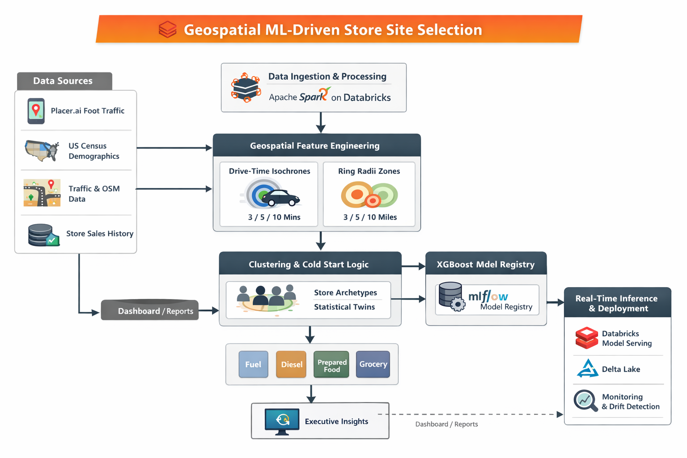

# Geospatial ML for New Store Site Selection &amp; Sales Forecasting
**Databricks · Spark · XGBoost · Geospatial Intelligence · MLflow · Unity Catalog**

**Client:** $10B+ convenience &amp; prepared foods retailer (2,500+ locations)  
**Role:** Lead Architect  

---

## Executive Summary

| Metric | Value |
|--------|-------|
| Client scale | $10B+ retailer · 2,500+ locations across the US |
| CAPEX allocation decisions informed (monthly) | **$50M+** |
| Site-selection approval cycle reduction | **70%** (3 weeks → 5 days) |
| Query latency improvement | **22×** (45s → &lt;2s) |
| Geospatial features engineered | **200M+** |
| Accuracy vs 3rd-party benchmarking tool | **+15% lift** |
| Data volume processed | **&gt;1TB** |

This system replaced intuition-driven real estate decisions with a **low-latency ML inference engine** generating **3-year category-wise sales forecasts** from a latitude/longitude input — reducing evaluation time from weeks to seconds and directly informing $50M+ in monthly capital allocation decisions.

---

## 1. Business Problem

### The Core Issue
Real estate expansion decisions at this client were:
- Decentralised across regional teams with inconsistent criteria
- Qualitative and subjective — dependent on individual real estate managers' instincts
- High-risk due to long-term CAPEX commitments and irreversible lease obligations

The organisation lacked:
- Standardised evaluation criteria across geographies
- Quantitative risk assessment for new site viability
- Scalability for evaluating multiple sites simultaneously

### Objective
Build a **data-driven site selection engine** to:
- Eliminate regional bias and standardise decision-making nationally
- Quantify upside and risk for any candidate site from geographic coordinates
- Scale across the entire US footprint
- Produce explainable forecasts for real estate and finance leadership

---

## 2. Why Machine Learning (Not Rules or BI)

### Why BI Failed
- Retrospective only — no inferential capability for unseen geographies
- Manual heuristics didn't scale across 2,500+ existing locations and new candidates
- Reinforced existing human bias in site selection

### Why ML Was Required
- **&gt;1,700 heterogeneous features**: demographics, mobility, infrastructure, competitor data
- Strong non-linear interactions between spatial drivers (e.g., highway access, school proximity)
- High-dimensional spatial relationships not capturable by rules or regression
- Cold-start problem: new-to-industry (NTI) sites have no historical sales to anchor on

### Impact
- **10× throughput** for site evaluation
- **Standardised investment scoring** across all geographies
- **Seconds-level inference latency** from lat/lon to 3-year forecast
- **Bias reduction** in multi-million dollar CAPEX decisions

---

## 3. Platform &amp; Architectural Choice: Why Databricks

- Managed Spark removed infrastructure overhead for large-scale geospatial joins
- Native support for distributed feature engineering across 200M+ spatial features
- MLflow-based governance for model lineage, versioning, and audit readiness
- Migration from schema-on-read Hive to **star-schema Delta + Unity Catalog** delivered **22× query latency improvement** (45s → &lt;2s)
- Faster time-to-market than raw AWS primitives given team's existing proficiency

---

## 4. Data Landscape

| Domain | Source | Purpose |
|--------|--------|---------|
| Human Mobility | Placer.ai | Footfall &amp; traffic behaviour |
| Demographics | US Census | Socio-economic context per trade area |
| Infrastructure | AADT + OpenStreetMap | Traffic volumes &amp; road accessibility |
| Store History | PostgreSQL | Sales ground truth for training |

### Data Hygiene Decisions
- Excluded stores with &lt;1.5 years of history (grand-opening bias distorts early-period sales)
- Excluded stores with &gt;5 years of history in some categories (legacy market conditions diverge from current expansion context)
- Final training dataset: **10 years of curated store history**

---

## 5. Spatial Feature Engineering

### Key Design Decision: Dual Trade-Area Framework

Rather than a single buffer radius, each candidate site was evaluated through **two spatial lenses**:

#### 1. Drive-Time Isochrones (3 / 5 / 10 minutes)
- Captures real accessibility based on road network topology
- Models friction from one-way roads, dividers, and traffic patterns

#### 2. Ring Radii (3 / 5 / 10 miles)
- Captures broader trade dynamics and highway-corridor behaviour
- Critical for diesel and long-haul truck categories

This dual framework standardised feature extraction consistently across all data sources and was a key differentiator over the 3rd-party tool's single-ring approach.

---

## 6. Feature Engineering at Scale (1,700+ Features)

### Positive Demand Drivers
- Schools, stadiums, and high-footfall destinations (Placer.ai)
- Highway access nodes and major road intersections (AADT)
- Gas pumps, kitchen layout variables, store format features

### Negative / Risk Drivers
- Competitor proximity (distance set to 9,999 when absent — treated as signal, not null)
- Turn complexity and wrong-side access friction
- Road network constraints modelled via graph traversal

### Handling High Dimensionality
- **Store Archetype Clustering** (Rural / Suburban / Urban) to reduce within-group variance
- **SHAP-based feature pruning** — preserved explainability and reduced noise without black-box selection

---

## 7. Spatial &amp; Data Integrity Challenges

### Graph-Based Proximity Logic
Euclidean distance was insufficient for real-world accessibility modelling. Road-network graphs were built to calculate true drive-time distances, capturing one-way roads, dividers, and access friction.

### Shapefile Processing
GeoPandas + Spark for point-in-polygon joins against US Census blocks — enabling accurate socio-economic attribution per trade area for each candidate site.

### Extreme Value Imputation
- Rural isolation handled explicitly: missing competitor distances set to 9,999 (signal of low competitive density)
- Missing mobility data imputed using archetype-cluster medians, not global statistics

---

## 8. Model Architecture

### Multi-Vertical Forecasting

Separate **XGBoost regressors** trained for each revenue vertical:
- Diesel fuel
- Gasoline
- Prepared food
- Grocery

Each model was trained on vertical-specific spatial and demographic drivers — fuel models prioritised highway features; prepared food models prioritised footfall and school proximity.

### Cold-Start Strategy for NTI Sites (Dual Clustering)

New-to-industry sites have no historical sales. The cold-start problem was solved through a **statistical twin** methodology:
1. Cluster existing stores by historical performance profile
2. Cluster US geography by NTI-available spatial features
3. Map candidate NTI site to its nearest statistical twin cluster
4. Use twin cluster median as contextual grounding before regression

---

## 9. Training Strategy

### Data Splitting
- **Stratified split (not time-based)** — stratified by store tier and geography to maintain representation across archetypes
- 70 / 15 / 15 with a locked holdout test set

### Key Design Decision: Stratified Over Time-Based Split
Time-based splits are appropriate for forecasting models where temporal leakage is a risk. For this cross-sectional spatial model — where the objective is predicting performance at a *new location*, not a future time — stratified splitting was more appropriate. It ensured coverage of rural, suburban, and urban archetypes across train/val/test.

### Validation
- 5-fold cross-validation within training set
- GridSearchCV for: tree depth, learning rate, subsampling ratios

---

## 10. Compute Optimisation

### Hybrid Compute Strategy
- **Spark clusters** → distributed feature engineering over 200M geospatial features
- **Single-node multi-GPU** → XGBoost model training (5× faster grid search vs distributed CPU)
- **Serverless model serving** → scale-to-zero for inference cost efficiency

### Feature Engineering Cost Controls
- Sliding-window spatial caching to avoid recomputing trade-area overlaps for nearby candidates
- Haversine pre-filtering reduced candidate pairs by ~60% before exact polygon joins

---

## 11. Evaluation Metrics

### Primary Metric: WMAPE (Weighted Mean Absolute Percentage Error)
- Selected to reflect business cost asymmetry — penalises errors on high-volume categories more heavily
- Aligns evaluation to capital allocation risk, not statistical convenience

### Benchmarking Results

| Benchmark | Accuracy |
|-----------|----------|
| 3rd-party industry tool (baseline) | ~50% |
| Acceptance threshold (client requirement) | 65% |
| Achieved | **65%+ consistently** |

**+15% accuracy lift** over the industry-standard 3rd-party tool the client was previously paying for.

---

## 12. Explainability &amp; Stakeholder Trust

### SHAP-Based Transparency

SHAP values were computed at two levels:
- **Global drivers** — overall feature importance for leadership-level understanding
- **Local reason codes** — site-specific drivers explaining individual forecasts

Example output delivered to real estate leadership:
> *Highway traffic (+20%), school proximity (+15%) outweigh competitor proximity (–5%) at this site. Forecast reflects strong fuel and grocery upside.*

### Bias &amp; Audit Readiness
- Full MLflow lineage: every forecast traceable to the model version, feature snapshot, and training data vintage
- Feature-level bias inspection available for regulatory and compliance review
- Reproducible forecasts: same inputs always produce same output (no stochastic inference)

---

## 13. Deployment Architecture

### Feature Consistency
- Delta Lake Silver layer shared between training pipeline and serving pipeline
- Eliminates training-serving skew — the exact same feature logic used in training applies at inference

### Serving
- Databricks Model Serving (serverless) for low-latency inference
- Notebook-based UAT with widgets for real estate team self-service validation
- Millisecond inference latency from lat/lon input to full 3-year category forecast

---

## 14. Monitoring &amp; Drift Detection

- ±8% WMAPE guardrails: automated alerts when model accuracy degrades beyond threshold
- Spatial trade-area drift detection: flags when the geographic distribution of scored sites shifts materially from the training distribution
- Annual census-driven retraining cadence — incorporates updated demographic and mobility baselines
- Human-in-the-loop override logging: real estate managers can flag model recommendations for supervisory review; overrides captured for future training signal

---

## 15. Rollout Strategy

1. **Shadow mode backtesting** — model ran in parallel with existing process for 8 weeks; predictions compared against actual outcomes without affecting decisions
2. **Regional pilots** — Des Moines and Little Rock markets selected as representative urban and rural test cases
3. **Champion/Challenger** — model predictions formally compared against 3rd-party tool scores; model outperformed on WMAPE across all verticals
4. **Full self-service production rollout** — real estate teams given direct access via Databricks-served endpoint

---

## 16. Technical Alternatives Evaluated and Rejected

| Alternative | Why Rejected |
|-------------|--------------|
| Time-Series Models (Prophet, SARIMA) | Failed on spatial shocks; high-dimensionality collapse at 1,700+ features |
| Bayesian MCMC | No convergence at scale; prohibitively expensive for feature volume |
| Neural Networks | Insufficient training data per vertical for deep models; XGBoost generalised better on tabular spatial data |
| Single-buffer trade area | Over-simplified real-world accessibility; dual framework significantly improved WMAPE |

---

## 17. Business Impact

- **$50M+ monthly CAPEX allocation decisions** informed by the model
- **70% reduction** in site approval cycle (3 weeks → 5 days)
- **15% accuracy lift** over industry-standard 3rd-party tool — which the client subsequently decommissioned
- **Standardised national expansion strategy** — consistent, defensible criteria applied across all geographies
- Millions in avoided CAPEX risk from sites that would have received approval without quantitative scoring

---

## 18. Lessons Learned

- **Dual trade-area frameworks are worth the engineering complexity:** The added geospatial computation cost was significant, but the WMAPE improvement justified it — particularly for highway-corridor diesel sites where radial buffers significantly outperformed isochrone-only approaches.
- **Cold-start via clustering requires careful archetype definition:** Statistical twins only work if the cluster structure reflects real business distinctions (rural/suburban/urban). Initial clustering attempts using pure geographic features produced economically meaningless archetypes. Adding performance-based clustering as the primary layer improved twin assignment quality substantially.
- **Human-in-the-loop overrides are data, not exceptions:** Real estate managers' override decisions captured valuable local knowledge (planned road changes, new competitor openings) that the model couldn't see. Logging and incorporating overrides into future training cycles is a high-value, low-effort improvement.
- **What I'd approach differently today:** A Huff gravity model for continuous market influence (rather than discrete trade-area boundaries), and real-time mobility ingestion to capture footfall pattern shifts without waiting for annual Placer.ai refreshes.

---

### High-Level Architecture

